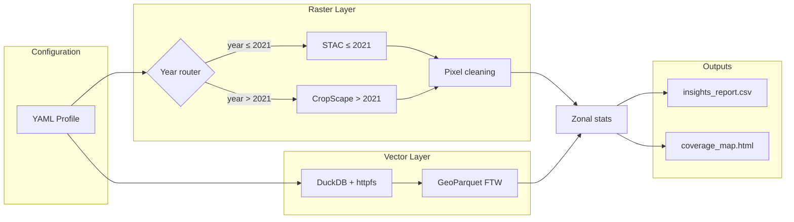

# Crop Field Footprint

**Cloud-native crop–field overlap analysis** for anywhere in the contiguous United States. Stream USDA [Cropland Data Layer (CDL)](https://www.nass.usda.gov/Research_and_Science/Cropland/) rasters and [Fields of the World (FTW)](https://source.coop/ftw) field boundaries from the cloud—no local source files required.

This repository refactors the original Yuma broccoli scripts (`download_preprocess_cdl_yuma.py`, `yuma_broccoli_ftw_zonal.py`) into a profile-driven, production-ready pipeline suitable for **any crop** (CDL class code) and **any WGS84 bounding box**.

---

## Architecture



| Layer | Technology | Role |
|--------|------------|------|
| **Raster** | STAC router + CropScape fallback | Years ≤ 2021: Planetary Computer COGs via range reads; years > 2021: USDA GetCDLFile streamed in memory |
| **Preprocess** | `rasterio.features.sieve`, `scipy.ndimage` | Crop mask, optional morphological open, noise removal |
| **Vector** | `duckdb` + `httpfs`, Source Cooperative S3 | Filter FTW GeoParquet by bbox in the cloud |
| **Analysis** | `rasterstats`, rule engine | Per-field acres, coverage %, hybrid/flat classification |
| **Outputs** | CSV, Folium | Tabular insights + interactive map with sticky tooltips |

---

## Quick start

```bash
cd crop-field-footprint
python3 -m venv .venv
source .venv/bin/activate
pip install -r requirements.txt

# Default profile: Yuma broccoli 2023 (CropScape fallback for year > 2021)
python main.py --profile config/profiles/yuma_broccoli.yaml --output-dir output
```

Open `output/coverage_map.html` in a browser and review `output/insights_report.csv`.

---

## CDL intelligent router

`src/data_streamer.py` selects the raster backend automatically:

| Condition | Source | Mechanism |
|-----------|--------|-----------|
| `year ≤ cdl.stac_max_year` (default **2021**) | Planetary Computer STAC | `pystac-client` + signed COG HTTP range reads |
| `year > cdl.stac_max_year` | USDA CropScape API | `GetCDLFile` → GeoTIFF URL read in memory via GDAL (no disk cache) |

Override the cutoff in your profile:

```yaml
cdl:
  stac_max_year: 2021
  cropscape_api: "https://nassgeodata.gmu.edu/axis2/services/CDLService/GetCDLFile"
  timeout_s: 600
  retries: 3
```

`run_metadata.json` records `cdl_source` as `"stac"` or `"cropscape"`.

---

## Configuration profiles

Profiles live under `config/profiles/`. Example: `yuma_broccoli.yaml`

```yaml
project_name: "Yuma Broccoli Spatial Overlap"
crop_name: "Broccoli"
cdl_crop_code: 214
year: 2023
bbox_wgs84: [-114.85, 32.45, -113.90, 32.80]

preprocessing:
  min_cluster_pixels: 4
  morph_open: false

classification_strategy: "hybrid_dynamic"
thresholds:
  min_crop_acres: 10.0
  small_parcel_max_acres: 10.0
  small_parcel_min_crop_acres: 3.0
```

### Classification strategies

| Strategy | Behavior |
|----------|----------|
| `hybrid_dynamic` | Large parcels: `crop_acres >= min_crop_acres`. Small parcels (`area < small_parcel_max_acres`): `crop_acres >= small_parcel_min_crop_acres` (optional `small_parcel_min_pct`). |
| `min_acres` | Flat minimum crop acreage per field. |
| `pct` | Flat minimum `pct_of_polygon` (requires `thresholds.min_crop_pct`). |

All thresholds are YAML-driven—no code changes needed for a new crop or region.

### Optional STAC / FTW overrides

```yaml
stac:
  api_url: "https://planetarycomputer.microsoft.com/api/stac/v1"
  collection: "usda-cdl"
  item_type: "cropland"
  asset_key: "cropland"

ftw:
  parquet_glob: "s3://ftw/global-data/predictions/vectors/alpha/results/*.parquet"
  s3_endpoint: "data.source.coop"
  label: "field"
```

---

## Outputs

| File | Description |
|------|-------------|
| `insights_report.csv` | Field ID, parcel acres, crop acres, coverage %, category (no geometry) |
| `coverage_map.html` | Folium map: fields colored by classification, sticky hover tooltips |
| `run_metadata.json` | Run parameters, thresholds, category counts |

---

## MCP server (for Cursor, Claude, Cline)

Expose the pipeline as an MCP tool so agents can run analyses from chat.

### Install

```bash
cd crop-field-footprint
source .venv/bin/activate
pip install -r requirements.txt   # includes `mcp` (FastMCP)
```

### Register in Cursor

Add to `.cursor/mcp.json` (or **Cursor Settings → MCP**):

```json
{
  "mcpServers": {
    "crop-field-footprint": {
      "command": "/absolute/path/to/crop-field-footprint/.venv/bin/python",
      "args": ["/absolute/path/to/crop-field-footprint/agent_skills/mcp_server.py"],
      "cwd": "/absolute/path/to/crop-field-footprint"
    }
  }
}
```

Restart Cursor. You should see the **Crop Field Footprint** server with one tool: `analyze_crop_footprint`.

### Tool: `analyze_crop_footprint`

| Parameter | Type | Required | Notes |
|-----------|------|----------|--------|
| `crop_name` | string | yes | e.g. `"broccoli"`, `"lettuce"` — resolved to USDA CDL code |
| `bbox_wgs84` | `[lon_min, lat_min, lon_max, lat_max]` | yes | WGS84 degrees; geocode place names **before** calling |
| `year` | int | yes | e.g. `2023` |
| `cdl_crop_code` | int | no | Override if crop name is ambiguous |
| `classification_strategy` | string | no | default `hybrid_dynamic` |
| `min_crop_acres`, `small_parcel_max_acres`, … | float | no | Threshold overrides |

**Agent cheat sheet — place → bbox**

| User says | Pass `bbox_wgs84` |
|-----------|-------------------|
| Yuma / Yuma AZ / Gila River | `[-114.85, 32.45, -113.90, 32.80]` |
| Imperial Valley | `[-115.65, 32.55, -114.45, 33.55]` |
| Salinas Valley | `[-121.55, 36.35, -121.05, 36.95]` |
| Central Valley (broad CA) | `[-121.00, 35.00, -118.50, 40.50]` |

**Agent cheat sheet — crop → CDL code (auto-resolved if omitted)**

| Crop | Code |
|------|------|
| Broccoli | 214 |
| Lettuce | 209 |
| Corn | 1 |
| Cotton | 2 |
| Grapes | 68 |
| Almonds | 75 |
| Tomatoes | 320 |

Full alias list: `agent_skills/crop_registry.py`.

### Example chat prompts

> “How much broccoli was in Yuma field parcels in 2023?”

The agent should call:

```json
{
  "crop_name": "broccoli",
  "bbox_wgs84": [-114.85, 32.45, -113.90, 32.80],
  "year": 2023
}
```

> “Run lettuce footprint in Salinas Valley for 2022 with 5 acre minimum.”

```json
{
  "crop_name": "lettuce",
  "bbox_wgs84": [-121.55, 36.35, -121.05, 36.95],
  "year": 2022,
  "min_crop_acres": 5.0
}
```

### Outputs

Each MCP run writes to `outputs/<crop>_<year>/`:

- `insights_report.csv`
- `coverage_map.html`
- `run_metadata.json`

The tool returns **markdown** with acreage metrics and absolute paths.

### Run the server manually (stdio)

```bash
python agent_skills/mcp_server.py
```

### Claude Desktop / Cline

Use the same `command` + `args` + `cwd` block as Cursor; transport is stdio over FastMCP.

---

## Project layout

```text
crop-field-footprint/
├── agent_skills/
│   ├── mcp_server.py         # FastMCP tool: analyze_crop_footprint
│   └── crop_registry.py      # CDL codes + region bbox presets
├── config/profiles/          # YAML analysis profiles
├── src/
│   ├── config_loader.py      # Profile parsing, CRS helpers
│   ├── data_streamer.py      # STAC / CropScape CDL router + FTW
│   ├── pixel_processor.py    # Sieve / morphological cleaning
│   ├── analyzer.py           # Zonal stats, rules, CSV, map
│   └── pipeline.py           # Shared programmatic runner
├── outputs/                  # MCP tool writes here
├── main.py                   # CLI entry point
├── requirements.txt
└── README.md
```

---

## Creating a new crop / region

1. Copy `config/profiles/yuma_broccoli.yaml` to e.g. `config/profiles/iowa_corn.yaml`.
2. Set `cdl_crop_code` ([CDL lookup](https://www.nass.usda.gov/Research_and_Science/Cropland/)), `bbox_wgs84`, `crop_name`, and `year`.
3. Tune `thresholds` and `classification_strategy` for domain rules.
4. Run: `python main.py --profile config/profiles/iowa_corn.yaml --output-dir output/iowa_corn`

---

## Requirements

- Python 3.10+
- Network access to Planetary Computer STAC and Source Cooperative (`data.source.coop`)
- ~2–4 GB RAM for typical county-scale AOIs (FTW query + in-memory rasters)

---

## License

Data sources retain their own terms (USDA NASS CDL, FTW / Source Cooperative). Application code is provided as-is for research and operational geospatial workflows.
